```mermaid
journey
  title Un simple día en mi vida xD
  section Día de estudio
    Estudiar: 5: Yo, Angel
    Investigar temas interesantes: 4: Yo, Angel
    Resolver problemas: 3: Yo, Demonio
  section Noche de aprendizaje
    Profundizar en hacking: 5: Yo, Demonio
    Resolver retos CTF: 5: Yo, Demonio
    Explorar nuevas herramientas: 4: Yo, Angel, Demonio
```

<!--<𝚌𝚘𝚍𝚎𝚛> ⸸𝕵𝖚𝖑𝖎𝖔𖤐𝖈𝖏7⸸ <𝚌𝚘𝚍𝚎𝚛/>
/*𝚂𝚒𝚖𝚙𝚕𝚢𝚃𝚑𝚎𝙱𝚎𝚜𝚝*/*𝚂𝚒𝚖𝚙𝚕𝚢𝚃𝚑𝚎𝙱𝚎𝚜𝚝*/*𝚂𝚒𝚖𝚙𝚕𝚢𝚃𝚑𝚎𝙱𝚎𝚜𝚝*/
  ——————————————————————————————————————————————————————————
  [¡𝙸𝙼𝙿𝙾𝚁𝚃𝙰𝙽𝚃!] 𝙳𝚎𝚓𝚊 𝚍𝚎 𝚌𝚘𝚙𝚒𝚊𝚛𝚖𝚎 𝚑𝚊𝚜𝚝𝚊 𝚎𝚕 𝚁𝙴𝙰𝙳𝙼𝙴.𝚖𝚍 ¡𝚒𝚗𝚖𝚞𝚗𝚍𝚘
  𝚊𝚗𝚒𝚖𝚊𝚕!, 𝚋𝚊𝚜𝚞𝚛𝚊𝚜 𝚌𝚘𝚖𝚘 𝚝𝚞 𝚗𝚘 𝚍𝚎𝚋𝚎𝚛í𝚊𝚗 𝚎𝚡𝚒𝚜𝚝𝚒𝚛, 𝚜𝚎 𝚊𝚞𝚝𝚎𝚗𝚝𝚒𝚌𝚘
  𝚢 𝚍𝚎𝚓𝚊 𝚍𝚎 𝚙𝚕𝚊𝚐𝚒𝚊𝚛 𝚜𝚌𝚛𝚒𝚙𝚝𝚜 𝚢 𝚎𝚜𝚝𝚒𝚕𝚘𝚜 𝚊𝚓𝚎𝚗𝚘𝚜.
  ——————————————————————————————————————————————————————————
/*𝚂𝚒𝚖𝚙𝚕𝚢𝚃𝚑𝚎𝙱𝚎𝚜𝚝*/*𝚂𝚒𝚖𝚙𝚕𝚢𝚃𝚑𝚎𝙱𝚎𝚜𝚝*/*𝚂𝚒𝚖𝚙𝚕𝚢𝚃𝚑𝚎𝙱𝚎𝚜𝚝*/
</ 𝚐𝚒𝚝𝚑𝚞𝚋 : qrd.cz/pwned />-->

<div align="center">
  <sup id="inicio">

  > \~•~
  </sup>
</div>

<div align="justify">
  <details align="center">
    <summary>  𝙹𝚞𝚕𝚒𝚘𖤐𝙲𝚓𝟽 </summary>
    <br>
    <p align="left"><strong><samp>「</samp></strong></p>
    <p align="center">
      <samp>
        <b>
            𝙿𝚛𝚘𝚢𝚎𝚌𝚝𝚘 𝚙𝚛𝚒𝚟𝚊𝚍𝚘 𝚢 𝚙𝚎𝚛𝚜𝚘𝚗𝚊𝚕,
        <br>
            𝚊𝚜í 𝚚𝚞𝚎 𝚙𝚞𝚎𝚍𝚎𝚜 𝚖𝚒𝚛𝚊𝚛 𝚙𝚎𝚛𝚘 𝚗𝚘 𝚌𝚘𝚙𝚒𝚊𝚛 𝚒𝚗𝚖𝚞𝚗𝚍𝚘 𝚊𝚗𝚒𝚖𝚊𝚕 𝚡𝙳
        </b>
      </samp>
      <p align="right"><strong><samp>」</samp></strong></p>
      <a href="#---">
        
      </a>
      <a href="#---">
        <picture>
          <source media="(prefers-color-scheme: dark)" srcset="https://github.com/Juliocj7/FlagCaptureCj7/blob/main/docs/author.svg">
          
        </picture>
      </a>
      <samp>
        <b>
            ~ 𝚜𝚒𝚖𝚙𝚕𝚢 𝚝𝚑𝚎 𝚋𝚎𝚜𝚝 𝚖𝚢 𝚏𝚛𝚒𝚎𝚗𝚍 ~
        </b>
      </samp>
      <br>
      <a href="#---">
        
      </a>
      <br>
    </p>
  </details>
</div>

<div align="center">
  <a href="#---">
    <picture>
      <source media="(prefers-color-scheme: dark)" srcset="https://github.com/Juliocj7/Juliocj7/blob/main/assets/image/banner-dark.gif">
      
    </picture>
  </a>
</div>

$$
\textcolor{#303030}{\_{+𝟻𝟿𝟷}} \space \textcolor{#303030}{\_{𝟽𝟿𝟺𝟸𝟺𝟿𝟹𝟽}} \space \textcolor{#303030}{\_{¡𝚌𝚘𝚗𝚝𝚊𝚌𝚝 \space 𝚖𝚎 \space!}}
$$

---

<div align="center">
  <a href="#---">
    
  </a>
  <a href="#---">
    
  </a>
</div>

<!--
<br>

<div align="center">
  
[](https://github.com/JulioCj7/Juliocj7/actions)[](https://github.com/JulioCj7/Juliocj7/actions)

</div>
-->

<div align="center">
  <br>
  <a href="https://t.me//JulioCj7">
    
  </a>
  <a href="https://wa.me//+59179424937?text=JulioCj7%20%F0%9F%92%A3%20SimplyTheBest">
    
  </a>
  <a href="https://fb.com//dimmuborgir">
    
  </a>
  <br>
  <a href="https://youtu.be//dQw4w9WgXcQ">
    
  </a>
</div>

<br>

<div align="center">
  <a href="https://github.com/Ashutosh00710/github-readme-activity-graph">
    <picture>
      <source media="(prefers-color-scheme: dark)" srcset="https://github-readme-activity-graph.vercel.app/graph?username=Juliocj7&bg_color=111111&color=888&line=17c6e1&point=915bf1&hide_border=true&hide_title=true">
      <!---->
      
    </picture>
  </a>
</div>

<!--

-->

<div align="center">
  <a href="https://github.com/Zachpocalypse/github-readme-stats">
    <picture>
      <source media="(prefers-color-scheme: dark)" srcset="https://github-readme-stats.vercel.app/api?username=JulioCj7&hide_title=true&hide_border=true&show_icons=true&include_all_commits=true&locale=es&count_private=true&line_height=21&text_color=000&icon_color=000&bg_color=0%2C52fa5a%2C4dfcff%2Cc64dff,&theme=graywhite">
      <!---->
      
    </picture>
  </a>
</div>

<div align="center">
  <a href="https://github.com/Juliocj7/CriptoCj7">
    <picture>
      <source media="(prefers-color-scheme: dark)" srcset="https://github-readme-stats.vercel.app/api/pin/?username=Juliocj7&repo=CriptoCj7&show_icons=true&locale=es&hide_border=true&icon_color=000&title_color=444&text_color=454545&bg_color=0%2C52fa5a%2C4dfcff%2Cc64dff&theme=graywhite">
      
    </picture>
  </a>
  <a href="https://github.com/Juliocj7/BinsgenCj7">
    <picture>
      <source media="(prefers-color-scheme: dark)" srcset="https://github-readme-stats.vercel.app/api/pin/?username=Juliocj7&repo=BinsgenCj7&show_icons=true&locale=es&hide_border=true&icon_color=000&title_color=444&text_color=454545&bg_color=0%2C52fa5a%2C4dfcff%2Cc64dff&theme=graywhite">
      
    </picture>
  </a>
  <a href="https://github.com/Juliocj7/DarkPhishCj7">
    <picture>
      <source media="(prefers-color-scheme: dark)" srcset="https://github-readme-stats.vercel.app/api/pin/?username=Juliocj7&repo=DarkPhishCj7&show_icons=true&locale=es&hide_border=true&icon_color=000&title_color=444&text_color=454545&bg_color=0%2C52fa5a%2C4dfcff%2Cc64dff&theme=graywhite">
      
    </picture>
  </a>
  <a href="https://github.com/Juliocj7/FlagCaptureCj7">
    <picture>
      <source media="(prefers-color-scheme: dark)" srcset="https://github-readme-stats.vercel.app/api/pin/?username=Juliocj7&repo=FlagCaptureCj7&show_icons=true&locale=es&hide_border=true&icon_color=000&title_color=444&text_color=454545&bg_color=0%2C52fa5a%2C4dfcff%2Cc64dff&theme=graywhite">
      
    </picture>
  </a>
</div>

<div align="center">
  <br>
  <a href="LICENSE">
    
  </a>
  <br><br>
</div>

<div align="center">
  <a href="#---">
    <picture>
      <source media="(prefers-color-scheme: dark)" srcset="https://github.com/JulioCj7/JulioCj7/blob/output/github-snake-best.svg">
      
    </picture>
  </a>
</div>

<br>

[](https://github.com/JulioCj7)


> [!CAUTION]
> > &nbsp;<a href="#---"></a> &nbsp;...&nbsp; ğš–𚢠ğš•ğšğšŠğš›ğš—ğš’ğš—ğš :
>
> > * [x] `𝙱𝚊𝚜𝚑`
> > * [x] `𝙿𝚢𝚝𝚑𝚘𝚗` 
> > * [x] `𝙿𝙷𝙿`
> > * [x] `𝙷𝚃𝙼𝙻𝟻`
> > * [x] `𝙲𝚂𝚂`
> > * [x] `𝙹𝚊𝚟𝚊𝚂𝚌𝚛𝚒𝚙𝚝`
> > * [x] `𝙲, 𝙲++, 𝙲#`
> > * [x] `𝚁𝚞𝚜𝚝`
> > * [x] `𝙶𝚘`
> > * [x] `𝙹𝚊𝚟𝚊`
> > * [x] `𝙺𝚘𝚝𝚕𝚒𝚗`
> > * [ ] `𝚂𝚠𝚒𝚏𝚝`

<!--
> [!CAUTION]
> <blockquote>
> <details>
>  <summary> &nbsp;<a href="#---"></a> &nbsp;...&nbsp; ğš–𚢠ğš•ğšğšŠğš›ğš—ğš’ğš—ğš : </summary>
>
> ###
> * [x] `𝙱𝚊𝚜𝚑`
> * [x] `𝙿𝚢𝚝𝚑𝚘𝚗` 
> * [x] `𝙿𝙷𝙿`
> * [x] `𝙷𝚃𝙼𝙻𝟻`
> * [x] `𝙲𝚂𝚂`
> * [x] `𝙹𝚊𝚟𝚊𝚂𝚌𝚛𝚒𝚙𝚝`
> * [x] `𝙲, 𝙲++, 𝙲#`
> * [x] `𝚁𝚞𝚜𝚝`
> * [x] `𝙶𝚘`
> * [x] `𝙹𝚊𝚟𝚊`
> * [x] `𝙺𝚘𝚝𝚕𝚒𝚗`
> * [ ] `𝚂𝚠𝚒𝚏𝚝`
> </details>
> </blockquote>
-->

<br>

<div align="center">

[](https://skillicons.dev)

[](https://skillicons.dev)

[](https://skillicons.dev)

</div>

<!--
<div align="center">
   
  <br>
  <br>
</div>
-->

<div align="center">
  
  
  
  
  
  
  
</div>

<!--

<hr>

<div align="center">
  <a href="#---">
    
  </a>
</div>

<hr>

[](#---)  
-->

<hr>

<details>
  <summary> ${\color{#4e4e4e}¡𝚂𝚞𝚛𝚙𝚛𝚒𝚜𝚎 \space ! } \space {\color{#0d1117}𝚖𝚘𝚝𝚑𝚎𝚛𝚏𝚞𝚌𝚔𝚎𝚛}$ </summary>
  <br>
  <a href="https://juliocj7.github.io/misc/music?play=https://github.com/Juliocj7/Juliocj7/raw/refs/heads/main/assets/music/0x1337.mp3" target="_blank">
    <picture>
      <source media="(prefers-color-scheme: dark)" srcset="https://raw.githubusercontent.com/juliocj7/juliocj7/main/myusercard/dark_mode.svg">
      
    </picture>
  </a>
  <p align="center"> $^{\color{#252525}\text{𝚞𝚜𝚎𝚛:}} \space ^{\color{#4e4e4e}\text{¡𝟶𝚡𝟷𝟹𝟹𝟽!}}$ </p>
</details>

<div align="center">
  <a href="#---">
    
  </a>
</div>

<hr>

<div align="center">

[](#---)

<!--
[](#---)
-->

<!--
[](#---)
-->

</div>

<hr>



<hr>

<!--

```mermaid
---
config:
  theme: base
  flowchart:
    curve: cardinal
    shape: stadium
    padding: 4
  themeVariables:
    lineColor: "#220033"
    primaryColor: "#220033"
    primaryBorderColor: "#220033"
    primaryTextColor: "#EEAAFF"
---
flowchart RL
  umd(𝚝𝚎𝚛𝚖𝚞𝚡)
  stb(𝟶𝚡𝟷𝟹𝟹𝟽)
  god(𝚎𝚗𝚌𝚛𝚢𝚙𝚝)
  bad(𝚍𝚎𝚌𝚛𝚢𝚙𝚝)
  way(𝚊𝚗𝚍𝚛𝚘𝚒𝚍)
  res(𝚊𝚠𝚎𝚜𝚘𝚖𝚎)
  lol(𝚒𝚜)
  stb --- god
  stb --- bad
  res --- lol --- way

  classDef default stroke-width:8px,font-weight:bold;
  linkStyle default stroke-width:8px;
```

$${\color{#202020}!} \space {\color{#333}Nunca \space dejes \space de \space aprender} \space {\color{#202020}!}$$
-->

<div align="center">
  <sub>

  > \~•~ 𝚒 𝚛𝙾𝙾𝚌𝚔 𝚢𝚘𝚞 \~•~
  </sub>
</div>

<div align="center">
  <a href="#---">
    <picture>
      <source media="(prefers-color-scheme: dark)" srcset="https://raw.githubusercontent.com/juliocj7/juliocj7/main/assets/image/g-01.gif">
      
    </picture>
  </a>
</div>  

<!--  while(!(success = try()))  -->

$$
\textcolor{#454545}{\_{𝙽𝚞𝚗𝚌𝚊 \space 𝚍𝚎𝚓𝚎𝚜 \space 𝚍𝚎 \space 𝚊𝚙𝚛𝚎𝚗𝚍𝚎𝚛, \space 𝚙𝚘𝚛𝚚𝚞𝚎 \space 𝚎𝚕}}
$$
$$
\textcolor{#454545}{\_{𝚌𝚛𝚎𝚌𝚒𝚖𝚒𝚎𝚗𝚝𝚘 \space 𝚗𝚘 \space 𝚝𝚒𝚎𝚗𝚎 \space 𝚕𝚒𝚖𝚒𝚝𝚎𝚜 \space 𝚢 \space 𝚎𝚕 \space 𝚎𝚡𝚒𝚝𝚘}}
$$
$$
\textcolor{#454545}{\_{𝚎𝚜 \space 𝚎𝚕 \space 𝚛𝚎𝚏𝚕𝚎𝚓𝚘 \space 𝚍𝚎 \space 𝚝𝚞 \space 𝚌𝚞𝚛𝚒𝚘𝚜𝚒𝚍𝚊𝚍.}}
$$  

$$
\textcolor{#252525}{\_{𝙹𝚞𝚕𝚒𝚘𝙲𝚓𝟽}} \space \textcolor{#202020}{\_{¡𝚂𝚒𝚖𝚙𝚕𝚢𝚃𝚑𝚎𝙱𝚎𝚜𝚝!}}
$$

<!--        :(){ :|:& };:        -->

<!--
```math
\textcolor{#353535}{_{𝙲𝚘𝚗𝚝𝚊𝚌𝚝: }} \quad \textcolor{#252525}{_{+𝟻𝟿𝟷}} \space \textcolor{#f85149}{_{𝟽𝟿𝟺𝟸𝟿𝟿𝟹𝟽}}
```
-->

<!--
```console
i'm@god:~$ echo "$JulioCj7"
𝚂𝚒𝚖𝚙𝚕𝚢𝚃𝚑𝚎𝙱𝚎𝚜𝚝   # (òÓ,)_,,/
```
-->

```ShellSession
[𝚒'𝚖@𝚐𝚘𝚍]:~$ 𝚎𝚌𝚑𝚘 "$𝙹𝚞𝚕𝚒𝚘𝙲𝚓𝟽"
𝚂𝚒𝚖𝚙𝚕𝚢𝚃𝚑𝚎𝙱𝚎𝚜𝚝          # ᓚᘏᗢ
```

<div align="center">
  <a href="https://git.io/typing-svg">
    
  </a>
</div>  

[](#---)

<!--
[](#---)
-->

<div align="center">
  <a href="#---">
    
  </a>
</div>

<div align="center">
  <sub>
    
  > 𝙼𝚊𝚍𝚎 𝚠𝚒𝚝𝚑 ❤️ 𝚋𝚢 𝙹𝚞𝚕𝚒𝚘𝙲𝚓𝟽

  </sub>
</div>

<br>

<div align="center">
  <a href="#inicio">
    <code><b>𝚂𝚌𝚛𝚘𝚕𝚕𝙱𝚊𝚌𝚔</b></code>
  </a>
</div>

<div align="right">
  <a href="#">
    
  </a>
</div>

<!-- ¡𝚂𝚞𝚍𝚘 𝚖𝚊𝚜𝚘𝚚𝚞𝚒𝚜𝚝𝚊!

<div align="center">

[](https://stars.medv.io/Juliocj7/Juliocj7)

</div>

---

<div align="center">
  <details>
    <summary>
      <h6> &#128293; 𝙹𝚞𝚕𝚒𝚘𝙲𝚓𝟽 &#128293; </h6>
    </summary>
    <p>
      𝚂 &nbsp;𝚒 &nbsp;𝚖 &nbsp;𝚙 &nbsp;𝚕 &nbsp;𝚢 &nbsp&nbsp;𝚃 &nbsp;𝚑 &nbsp;𝚎 &nbsp;&nbsp;𝙱 &nbsp;𝚎 &nbsp;𝚜 &nbsp;𝚝
    </p>
    <a href="https://stardev.io/developers/Juliocj7">
      
    </a>
    
  ----
  ### $\color{red}{Simply\ The\ Best\ JulioCj7!}$

  </details>
</div>

---

> [!CAUTION]
> <blockquote>
> <details>
>  <summary>&nbsp; :egg: 𝙴𝚊𝚜𝚝𝚎𝚛 𝚎𝚐𝚐 :egg:</summary>
>
> ###
> $${\color{#353535}𝙰𝚞𝚝𝚑𝚘𝚛..: } \space {\color{#f85149}𝚂𝚒𝚖𝚙𝚕𝚢𝚃𝚑𝚎𝙱𝚎𝚜𝚝}$$
> $${\color{#353535}𝙲𝚘𝚗𝚝𝚊𝚌𝚝.: } \space {\color{#252525}+𝟻𝟿𝟷} \space {\color{#f85149}𝟽𝟿𝟺𝟸𝟺𝟿𝟹𝟽}$$
> </details>
> </blockquote>

---

<div align="center">
  <p>
    <a href="mailto:SimplyTheBest@gmail.com" target="_blank" title="mail">
      
    </a>
    <a href="https://JulioCj7.github.io/projects" target="_blank" title="blog">
      
    </a>
  </p>
</div>

---

<div align="center">

  [](https://youtu.be/dQw4w9WgXcQ)
  
  <a href="https://github.com/JulioCj7">
    <table align="right">
      <tr>
        <td>
          👉 &nbsp;&nbsp;exit 0
        </td>
      </tr>
    </table>
  </a>
  <br><br>
</div>

---

<div align="center">

**[<kbd> <br> Install <br> </kbd>][Install]** 
**[<kbd> <br> Configure <br> </kbd>][Configure]** 

[Install]: https://github.com/Juliocj7/docs/installation
[Configure]: https://github.com/Juliocj7/docs/configuration

</div>

---

```mermaid  sed - -> 2 --­>
graph LR
    A[😎 User Access] - ->|­ scan ­| B[🤪 Shield]
    B - ->|­ verify ­| C[🤬 Security Check]
    C - ->|­ ying ­| D[😇 angel]
    C - ->|­ yang ­| E[😈 devil]
    style A fill:#222222
    style B fill:#222222
    style C fill:#222222
    style D fill:#00d7ff
    style E fill:#d70000
```



---

<div align="center">

```diff
- 🚨 SECURITY DISCLAIMER 🚨
```

  <div align="left">

```diff
@@ THIS IS A PROOF OF CONCEPT - FOR EDUCATIONAL PURPOSES ONLY @@
+ Use Responsibly
! Always Get Proper Authorization
```

  </div>

[](#---)

</div>

---

themes: rule34 gelbooru-h moebooru-h
<div align="center">
  
</div>

---

<div align="center">
  <a href="https://www.buymeacoffee.com/juliocj7">
  </a>
  <a href="https://ko-fi.com/juliocj7">
  </a>
</div>

---

<div align="center">

##### **[`             Inicio              `](#)**

</div>

[./reality: SIGSEGV, Segmentation fault (core dumped)](https://网.com/#×͜×)

---

<div align="center">
  <a href="https://shell.cloud.google.com/cloudshell/open?cloudshell_git_repo=https://github.com/Juliocj7/FlagCaptureCj7.git&tutorial=0x1337.md" target="_blank">
    
  </a>
</div>

-->

<!-- 𝙲𝚘𝚙𝚢𝚛𝚒𝚐𝚑𝚝 © 𝟸𝟶𝟸𝟻 𝚊𝚕𝚕 𝚛𝚒𝚐𝚑𝚝𝚜 𝚛𝚎𝚜𝚎𝚛𝚟𝚎𝚍 🖕🏻 -->
